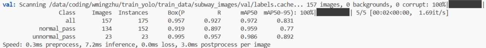

# 1.目标检测

## 1.1 模型训练

### 1.1.1 2024/6/6

- **数据**

  设置了两类normal_pass和unnormal_pass(标注的内容是人和闸机，即人正常通过闸机和翻越通过闸机)。使用了472张图片训练，157张图片验证，每张图片有1-2个目标，总体目标normal和unnormal的比值大概是6:4，接近7:3，所以说unnormal的比重较小，下次标注训练时要平衡下。

- **模型**

  使用的是ultralytics github的基于COCO8 0 pre-trained classes的YOLOv8m.pt。得到模型大小为50M。

- **超参数**

  batch=32;epoch=15

- **验证指标**

  

- **推理测试**

  实际上翻阅闸机的情况非常少见，日常地铁里的视频流里面的乘客均是正常通过，所以测试时应该用真实的日常地铁站的记录视频，检验误报率是否高。

### 1.1.2 2024/6/17

训练了单标签模型，测试效果极差，连正常站立不在闸机处的人都会当结果识别出来。不作记录了，单表签方案不行。

### 1.1.3 2024/6/19

- **数据**

  在2024/6/6标注的数据基础上增加标注了一些，依然是normal和unnormal两类。unnormal的信息目标还是少的

- **模型**

  预训练模型选择的是yolov8l

- **超参数**

  batch=28(因为在16G显存的机子上训练这个模型最高能承受这么大batch);epoch=32

- **验证指标**

  

  反倒不如2024/6/6的在yolov8m上的指标，难道是模型越大需要更多的训练数据才能发挥模型效果吗？或者是batchsize小了效果差了点。

  于是我再以yolov8m为基础模型训练一下，验证指标如下(此时batch可以设为32了，因为模型本身占用少了)：

  

​		数据更差，看来是标注问题，数据标的可能没2024/6/6好。

### 1.1.4 下一阶段todo

**转变方向，只检测人而不包括闸机，因为包括闸机的话数据量不够，训练难度太大，不易实现良好效果，怕是从某个角度看过去即便认识直直走过闸机也像是训练素材里的翻越闸机，又或者是闸机的材质形状颜色等跟训练数据里的差异大，模型又不认识了，所以还是检测人简单靠谱些。给人分为翻越、行走、弯腰等多个类别，然后检测到翻越时送到clip中过滤，不过要注意截取时要包含环境信息，这样才能让clip进行准确的判断，代码已实现**

- **增加数据，各种类别的数据量还是要保证的，这是模型泛化能力的保证**
- **提高标注精度，利用所有的视频，每个类别只标注最符合的目标动作的那几个关键帧**
- **提高训练轮次和batch大小，这个经测试对效果提升很有用，能不能提高泛化能力不知道，至少在训练和验证集上明显提升了**

**此后推理就可以设置高的conf,因为检测人比较准。**

### 1.1.5 新的方案，只标注人

**分类:**

stand站

squat 蹲

bend 弯腰

fall 躺地

sit 坐

climb 翻越

本模型也可用于跌倒检测那个功能。

**数据**

212：/home/ai/wmz/climbing/train_val_202040628 

本地："C:\Users\wmingdru\Desktop\workspace\data\temp_material\train_val_202040628"

**模型**

预训练模型yolov8l.pt

**测试结果太烂了，不忍直视，还是得按照之前的标法，人和闸机一起标。**

# 2.目标追踪

## 2.1使用boxmot

## 2.2 使用ultralytics提供的追踪器

目前使用的就是这个

# 3.分类器

## 3.1CLIP分类器

metaclip效果不错，但模型太大；

目前使用的是moda社区的Chinese clip，https://www.modelscope.cn/models/iic/multi-modal_clip-vit-large-patch14_336_zh/files

## 3.2 使用ultralytics提供的pose检测然后进行分类

# 4.综合

## 4.1 

