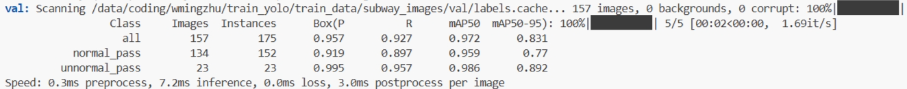

# 1.目标检测

## 1.1 模型训练

### 1.1.1 2024/6/6

- **数据**

  设置了两类normal_pass和unnormal_pass。使用了472张图片训练，157张图片验证，每张图片有1-2个目标，总体目标normal和unnormal的比值大概是6:4，接近7:3，所以说unnormal的比重较小，下次标注训练时要平衡下。

- **模型**

  使用的是ultralytics github的基于COCO8 0 pre-trained classes的YOLOv8m.pt。得到模型大小为50M。

- **超参数**

  batch=32;epoch=15

- **验证指标**

  

- **推理测试**

  实际上翻阅闸机的情况非常少见，日常地铁里的视频流里面的乘客均是正常通过，所以测试时应该用真实的日常地铁站的记录视频，检验误报率是否高。

### 1.1.2 2024/6/17

# 2.目标追踪

使用boxmot

# 3.CLIP分类器

## 3.1 使用预训练模型

## 3.2 在预训练模型基础上用地铁数据再训练

## 3.3 提示词

根据测试的结果，找到误报的例子，将其表述成提示词，然后由分类器分类后可以把这种情况分类出来，减少误报

# 4.综合

## 4.1 整个算法流程的推理速度

